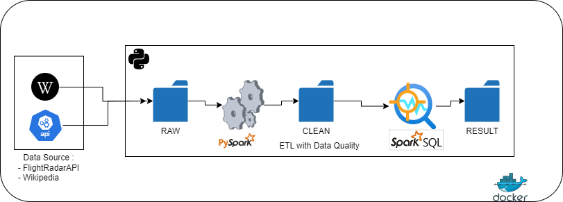
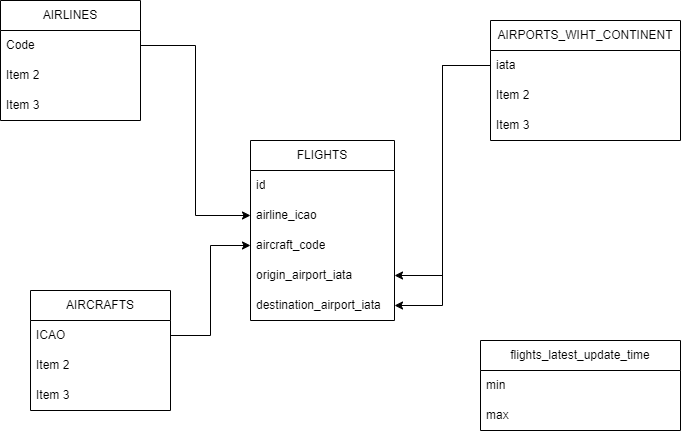

# Pipeline ETL FlightRadar24

Ce projet vise à créer un pipeline ETL (Extract, Transform, Load) pour traiter les données de l'API FlightRadar24, qui recense les vols aériens, les aéroports et les compagnies aériennes à travers le monde. La librairie Python [FlightRadarAPI](https://github.com/JeanExtreme002/FlightRadarAPI) facilite l'utilisation de cette API.

## Résultats

Le pipeline ETL génère les indicateurs suivants :

1. La compagnie avec le plus de vols en cours. 
2. Pour chaque continent, la compagnie avec le plus de vols régionaux actifs (continent d'origine == continent de destination).
3. Le vol en cours avec le trajet le plus long.
4. Pour chaque continent, la longueur de vol moyenne.
5. L'entreprise constructrice d'avions avec le plus de vols actifs.
6. Pour chaque pays de compagnie aérienne, le top 3 des modèles d'avion les plus utilisés.

Les emplacements des résultats des différentes questions sont situés dans le dossier suivant qui est horodaté **"/proceded_data/results/"** en format parquet. 
Pour consulter directement, veuiller consulter le notebook **Show results.ipynb**. 
Pour ce test, seules les données de vols (flights) sont mises à jour automatiquement à une fréquence d'une heure. La mise à jour des autres données est effectuée manuellement car elles ne changent pas fréquemment.

## Industrialisation

Ce ETL est conçu dans une optique d'industrialisation, avec les principes suivants :

- **Fault-tolerant** : Le pipeline est robuste et capable de gérer des cas exceptionnels sans arrêt brutal. Un pipeline en panne n'affecte pas un autre.
- **Observable** : Les logs contiennent des informations pertinentes pour le suivi du pipeline.
- **Systématique** : Les données et les résultats sont stockés avec une nomenclature adaptée, permettant aux analystes de retrouver facilement les valeurs recherchées pour une date et une heure données.

## Choix des outils

Pour accomplir ce test, plusieurs technologies ont été utilisées, chacune pour des raisons spécifiques :

- **Spark avec pySpark et spark.sql** : Spark est une plateforme open source idéale pour le traitement de données à grande échelle, offrant la possibilité de traiter des données en mode batch ou streaming. Son API pySpark permet une intégration aisée avec Python, tandis que son support SQL facilite les requêtes et les transformations de données.

- **Docker pour la conteneurisation de Spark** : L'installation et la configuration de l'environnement Spark peuvent être chronophages. Docker a été choisi pour sa capacité à créer des environnements isolés et reproductibles rapidement. L'image Docker utilisée peut être trouvée [ici](https://quay.io/repository/jupyter/pyspark-notebook). Faut juste installer les librairies suivantes : subprocess.run==0.0.8, schedule==1.2.1, pycountry==23.12.11, pycountry-convert==0.7.2

- **Pandas** : Pandas reste un outil incontournable pour le traitement des données de petite à moyenne taille, grâce à sa facilité d'utilisation et sa richesse de fonctionnalités.

- **Python et SQL** : Ces deux langages sont utilisés en raison de la familiarité et de l'aisance de l'auteur avec leur utilisation.

- **Parquet** : Format de stockage en colonnes open source, Parquet offre des avantages en termes de débit et de performances, en plus d'être adapté au stockage de données volumineuses.

- **Jupyter** : L'utilisation de Jupyter Notebook facilite le développement en permettant de coder de manière interactive dans des cellules, ce qui accélère le processus de développement et de test.

## Data engineering : 

Comme son nom l'indique, cet ETL se compose de trois phases principales :

1. **Phase d'extraction** : Cette étape consiste à récupérer les données à partir des sources de données et à les stocker dans un répertoire brut (raw). La principale source de données utilisée est l'API de FlightRadarAPI. Cependant, certaines fonctionnalités de cette API sont limitées, notamment en ce qui concerne la récupération des informations détaillées sur les vols ou les aéroports. Pour répondre aux questions posées, il a été nécessaire de rechercher d'autres sources de données. Par exemple, les noms des constructeurs d'avions ont été obtenus à partir de Wikipedia (https://en.wikipedia.org/wiki/List_of_aircraft_type_designators), tandis que les pays des compagnies aériennes ont été récupérés depuis (https://en.wikipedia.org/wiki/List_of_airline_codes).
Le script principal résponsable de cette partie est :  **pipelines\extract.py**

2. **Phase de nettoyage et de transformation des données** : Cette phase vise à garantir la qualité des données en effectuant des opérations de nettoyage et de transformation. Elle comprend un pipeline de traitement qui comprend la suppression des doublons, la normalisation des valeurs, l'arrondissement des chiffres, le typage des données, etc.
Le script principal résponsable de cette partie est :  **pipelines\clean_transform.py**

3. **Phase de réponse au questionnaire et de chargement des données** : Dans cette dernière phase, les données sont analysées pour répondre aux questions spécifiques posées dans le cadre du test. Une fois les réponses générées, elles sont chargées dans un répertoire dédié, généralement désigné comme "proceded_data/results".
Le script principal responsable de cette partie est situé à l'emplacement suivant : "pipelines\results.py".
Tous les scripts responsables de cette ETL se trouvent dans le dossier "pipelines" et toutes les données sont sauvegardées dans "proceded_data".

## Modélisation des données :
La modélisation des données consiste à organiser nos différentes données de manière à répondre de manière simple et optimale à toutes les questions posées.

Pour ce faire, nous avons opté pour un système de vues à partir de nos DataFrames Spark afin d'exploiter au maximum nos requêtes complexes.

Voici nos différentes vues :
- flights : notre vue de faits.
- airlines, airports, aircrafts, airlines_by_country : qui serviront à nos vues de dimensions.
- flights_latest_update_time : qui prend les dates (min et max) de la dernière mis à jour de notre vue de fait fligths. Celle vue est utile pour recuperer tous les vols en cours.

L'idéal ici est d'implémenter un schéma en étoile afin de mieux utiliser nos requêtes SQL.

## Architecture Idéale

Cet ETL est opérationnel pour un MVP cependant pour une implémentation idéale en environnement de production, voici les éléments à considérer :

- **Ordonnancement** : Utilisation d'un outil d'ordonnancement pour planifier et exécuter le pipeline à intervalles réguliers. Actuellement un cron a été mis en place avec Python. Pour le lancer il faut exectuer la commande suivante : **python cron_flights_and_results.py**. Pour une solution plus robuste, des outils comme Airflow ou des plateformes de données avec des schedulers intégrés comme Databricks peuvent être utilisés.

- **Monitoring** : Mise en place d'un système de monitoring pour surveiller la santé du pipeline et détecter les incidents. Des outils comme Grafana ou les dashboards de Databricks peuvent être utilisés pour visualiser les métriques clés du pipeline.

- **Data Warehousing** : Il est idéal d'avoir un data warehouse pour centraliser les données traitées, permettant ainsi aux analystes de données de les trouver facilement et de les interroger pour générer des insights pertinents.

- **Versioning** : Mise en place d'un système de versioning pour suivre les changements apportés au code source du pipeline. Cela permet de faciliter la collaboration entre les développeurs et de revenir à des versions antérieures si nécessaire.

- **Scalabilité** : Assurer que le pipeline est conçu pour être scalable, c'est-à-dire qu'il peut traiter efficacement un volume croissant de données sans compromettre les performances. Cela peut être réalisé en utilisant des technologies adaptées comme Spark qui est conçu pour le traitement de données massives.

- **Data Storage** : Choix d'une solution de stockage de données adaptée aux besoins du pipeline, en prenant en compte la taille des données, les performances d'accès, la durabilité et la cohérence. A titre d'exemple le stockage cloud comme AWS S3 ou Azure Blob Storage Gen 2.

